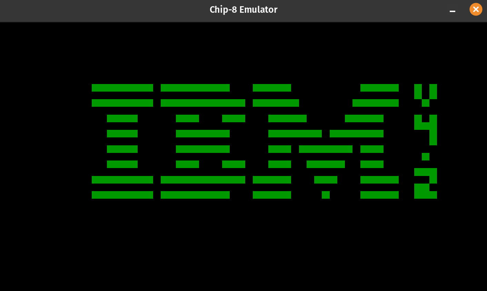

# Chip-8 Emulator

Chip-8 Emulator written in Rust.



## Build from source

Clone the project to your local system and follow the instructions below.

### Prerequisites

- A Linux based system
- `cargo` is installed
- `alsa.pc` library needs to be installed (Can be installed on Ubuntu via `apt install -y libasound2-dev`)

### Building

Run the following command from the root of the project to build the executable:

```sh
cargo build --release
```

The resulting executable is located at `./target/release/chip_8_emulator`

## Running the Emulator

Start the emulator with the `flightrunner.ch8` rom like this:

```sh
./target/release/chip_8_emulator ./roms/flightrunner.ch8
```

### Controls

The original Chip-8 keypad looked like this:

| Original CHIP-8 |
| --------------- |
| 1 2 3 C         |
| 4 5 6 D         |
| 7 8 9 E         |
| A 0 B F         |

You can press `ESC` to close the emulator.
All other keyboard inputs are ignored by the emulator.

#### Controls for flightrunner.ch

- `5` is up
- `8` is down
- `7` is left
- `9` is right

The goal is to fligh until the end of the level.

---

## Tests

The repository includes some test roms in `./roms/test/`. They can be run like this to validate the emulator behaviour:

```sh
cargo run .\roms\test\1-chip-logo.ch8
```

See [chip8-test-suit repo](https://github.com/Timendus/chip8-test-suit) for more information about the expexted output.

---

## Credits

- [Cowgod](http://devernay.free.fr/hacks/chip8/C8TECH10.HTM) for the description of chip-8 functionality
- [chip8.gulrak.net](https://chip8.gulrak.net/) for the opcode table
